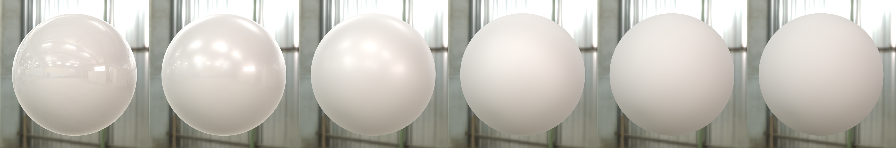
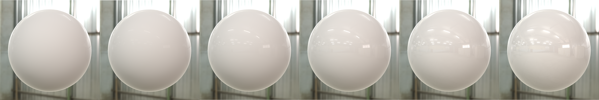
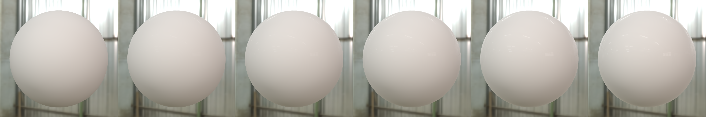
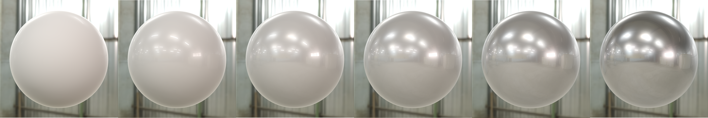
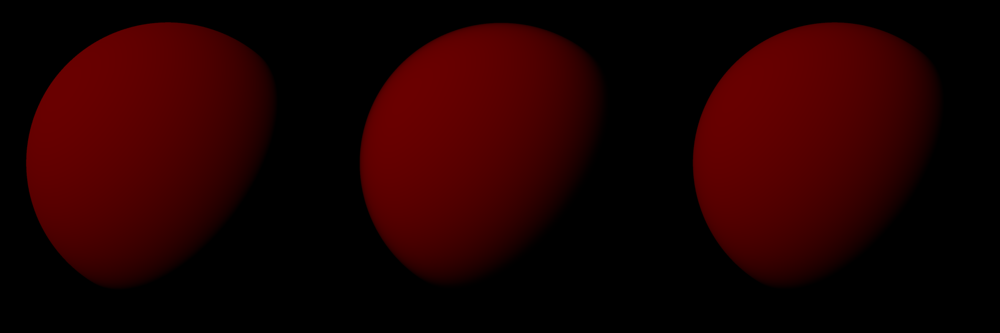
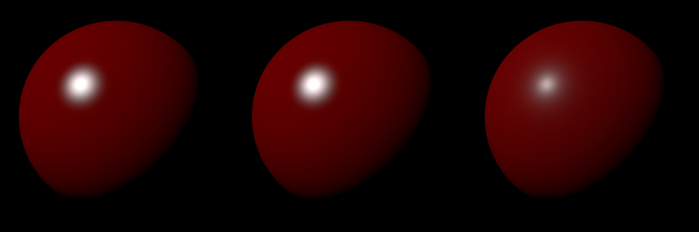

# PBR Material Editor

**Parker Ford, 2024**

A real-time rendering application showcasing several physically based BRDF implementations, complete with flexible lighting and material configuration options.

## Links

- [GitHub](https://github.com/parker-ford/PBR-Material-Editor)
- [Video Demo](https://www.youtube.com/watch?v=z6hTcYY6oB0)
- [Download (1.52GB)](https://drive.google.com/file/d/1hVonq3XQPNJjInFDGg9NX7X75FO9qYM2/view?usp=sharing)

## Features

### Physically Based BRDFs

- Includes implementations of several widely used physically based bidirectional reflectance distribution functions (BRDFs).

### Lighting Support

- **Direct Lighting**: Directional lights with color, intensity, and directional controls.
- **Image-Based Lighting**: Prefiltered environment maps for computing both diffuse and specular lobes. Specular lobe approximated using Brian Karis' Split Sum technique (see references).

### User Interface

- Tweak understandable material properties.
- Change lighting settings in real-time.
- Switch between different BRDF models, meshes, textures, and environments.

### Currently Implemented Material Properties

- Roughness
- Reflectance
- Diffuse Color
- Metallic
- Clearcoat
- Clearcoat Gloss
- Sheen
- Sheen Tint
- Subsurface

#### Example Visuals

- **Roughness**:  
  
- **Reflectance**:  
  
- **Clearcoat**:  
  
- **Metallic**:  
  

### Currently Implemented Diffuse Models

- Lambertian
- Hammon
- Disney

#### Example Visuals

- **Diffuse Models (left to right)**: Lambertian, Hammon, Disney  
  

### Currently Implemented Normal Distribution Functions

- GGX
- Beckman
- Blinn-Phong

#### Example Visuals

- **NDFs (left to right)**: Blinn-Phong, Beckman, GGX  
  

### Currently Implemented Geometry Attenuation Functions

- Beckman
- GGX
- Schlick GGX

### Texture Support

- Diffuse Mapping
- Normal Mapping
- Parallax Displacement Mapping
- Roughness Mapping
- Metallic Mapping

## Resources

- _Real-Time Rendering, 4th Edition_ - Tomas Akenine-Möller et al.
- _Real Shading in Unreal Engine 4_ - Brian Karis
- _Image-Based Lighting (IBL) of PBR Materials_ - Thorsten Thormählen
- Textures, environments, and meshes sourced from [polyhaven.com](https://polyhaven.com)
